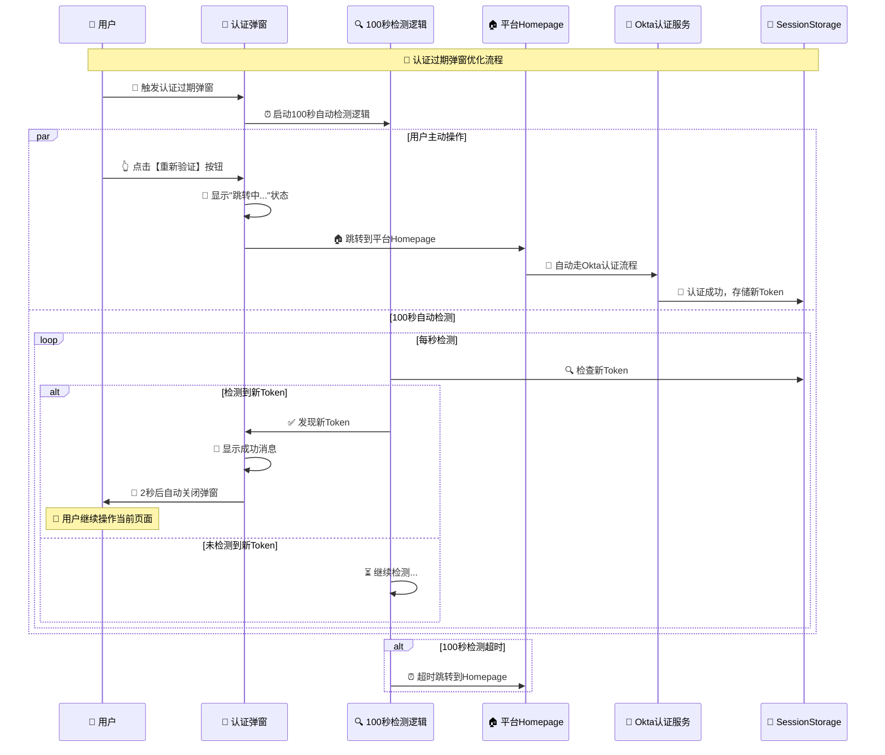

# 🚨 认证过期弹窗优化指南

## 🎯 优化重点

根据您的要求，我们专门优化了认证过期弹窗的核心功能：

### 🔄 优化的流程步骤



## 🔧 具体优化内容

### 1️⃣ **【重新验证】按钮优化**

#### ✅ **优化前问题**
- 按钮点击后无明确反馈
- 跳转过程用户不清楚发生了什么
- 缺少操作指引

#### 🚀 **优化后效果**
```typescript
const handleReauthorize = () => {
    console.log('🔐 用户点击【重新验证】按钮');
    setIsReauthorizing(true);
    addDetectionEvent('用户点击重新验证 - 跳转到Homepage');
    
    // 显示跳转状态，然后执行跳转
    setTimeout(() => {
        console.log('🏠 跳转到平台Homepage，然后走Okta认证流程');
        addDetectionEvent('跳转到Homepage - 开始Okta认证');
        onReauthorize(); // 跳转到Homepage然后Okta认证
    }, 500);
};
```

#### 🎨 **UI改进**
- ✅ 按钮点击后显示Loading状态
- ✅ 明确显示"跳转到平台Homepage中..."
- ✅ 详细的操作说明指引
- ✅ 渐变按钮设计，更突出

### 2️⃣ **100秒自动检测逻辑优化**

#### ✅ **优化前问题**
- 检测过程不透明
- 用户不知道系统在做什么
- 缺少检测事件记录

#### 🚀 **优化后效果**
```typescript
// 增强的100秒自动检测逻辑
useEffect(() => {
    console.log('🚨 认证过期弹窗已显示 - 启动100秒自动检测逻辑');
    addDetectionEvent('弹窗启动 - 开始100秒自动检测');

    // 智能token检测（每秒检查一次）
    checkInterval = setInterval(async () => {
        const tokenInfo = await getTokenInfo();
        if (tokenInfo && !tokenInfo.isExpired) {
            console.log('✅ 检测到新Token - 自动关闭弹窗');
            addDetectionEvent('✅ 检测到新Token - 认证成功');
            setHasNewToken(true);
            
            // 显示成功消息2秒后自动关闭
            setTimeout(() => {
                console.log('🔄 弹窗自动关闭 - 用户继续操作当前页面');
                onClose();
            }, 2000);
        }
    }, 1000);
}, [isOpen, onClose, timeRemaining]);
```

#### 🎨 **UI改进**
- ✅ 实时显示检测状态和剩余时间
- ✅ 可视化进度条显示检测进度
- ✅ 检测事件日志实时更新
- ✅ 明确的检测成功反馈

### 3️⃣ **完整流程状态管理**

#### 📊 **状态机设计**
```typescript
// 弹窗状态
const [isReauthorizing, setIsReauthorizing] = useState(false);   // 重新验证中
const [hasNewToken, setHasNewToken] = useState(false);           // 检测到新Token
const [detectionEvents, setDetectionEvents] = useState([]);     // 检测事件日志
```

#### 🎭 **三种状态UI**
1. **🚨 正常状态**: 显示重新验证按钮和100秒检测
2. **🔄 跳转状态**: 显示"跳转到Homepage中..."
3. **✅ 成功状态**: 显示"检测到新Token，即将关闭"

## 🧪 如何测试优化功能

### 🌐 访问测试页面
```bash
# 访问完整流程演示
http://localhost:8080/auth-tester
```

### 🔧 测试步骤

#### 1️⃣ **触发认证过期弹窗**
- 在演示页面点击"Start Complete Flow Demo"
- 等待演示进入失败重试阶段
- 观察认证过期弹窗的显示

#### 2️⃣ **测试【重新验证】按钮**
- 点击弹窗中的【重新验证】按钮
- 观察按钮状态变化：按钮 → Loading → 跳转状态
- 确认跳转到平台Homepage的流程

#### 3️⃣ **测试100秒自动检测**
- 观察弹窗右上角的倒计时：100s → 99s → 98s...
- 查看蓝色检测区域的实时状态更新
- 观察检测日志的实时记录

#### 4️⃣ **测试自动关闭功能**
- 在其他标签页完成Okta认证
- 观察弹窗自动检测到新Token
- 确认弹窗显示成功消息并自动关闭

## 📋 优化后的特性

### ✅ **用户体验优化**
1. **明确的操作反馈**: 每个操作都有清晰的状态反馈
2. **透明的检测过程**: 用户可以看到系统在做什么
3. **详细的操作指引**: 清楚告诉用户接下来会发生什么
4. **智能的自动恢复**: 支持多标签页操作，自动检测恢复

### 🔧 **技术实现优化**
1. **增强的事件日志**: 记录每个关键操作和检测事件
2. **状态管理优化**: 清晰的状态机设计
3. **错误处理改进**: 更好的异常情况处理
4. **性能优化**: 智能的检测间隔和资源清理

### 🎨 **界面设计优化**
1. **渐变按钮设计**: 更突出的【重新验证】按钮
2. **可视化进度条**: 直观显示100秒检测进度
3. **分层信息展示**: 重要信息突出，详细信息折叠
4. **中文本土化**: 符合中文用户使用习惯

## 🚀 生产环境部署

### 📝 配置检查
```typescript
// 确认配置正确
export const AUTH_CONFIG = {
    modalTimeout: 100,      // 100秒自动检测
    retryInterval: 10,      // 10秒重试间隔
    maxRefreshAttempts: 3,  // 最多重试3次
};
```

### 🔍 监控指标
- **弹窗触发频率**: 监控认证过期的频率
- **重新验证成功率**: 用户点击重新验证的成功比例
- **自动检测成功率**: 100秒内自动检测到新Token的比例
- **用户操作路径**: 用户选择手动验证 vs 等待自动检测的比例

## 🎉 总结

这次优化完全聚焦于您要求的核心功能：

✅ **【重新验证】按钮流程** - 点击后跳转到Homepage然后走Okta认证  
✅ **100秒自动检测逻辑** - 智能检测新Token并自动关闭弹窗  
✅ **完整的用户反馈** - 每个步骤都有清晰的状态显示  
✅ **生产级用户体验** - 专业的UI设计和交互流程  

现在的认证过期弹窗提供了完整的、用户友好的认证恢复体验！🚀
