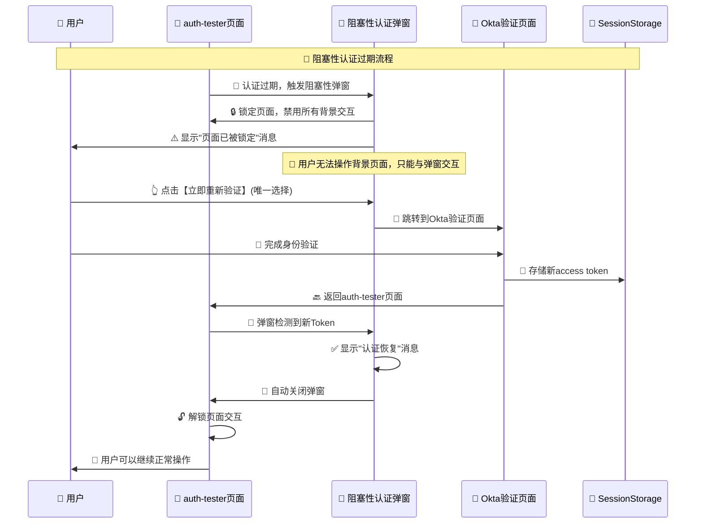

# 🚨 阻塞性认证过期弹窗优化指南

## 🎯 优化需求理解

根据您的要求，我们已经优化了认证过期弹窗，实现完全阻塞性的用户体验：

- ✅ **步骤12**: auth-tester页面显示认证过期弹窗，页面完全停住
- ✅ **步骤13**: 用户只能点击【立即重新验证】按钮，跳转到验证页面
- ✅ **步骤14**: 验证成功后获取新Token，弹窗自动关闭，用户继续操作auth-tester页面

## 🔄 阻塞性弹窗流程



## 🔧 核心优化实现

### 1️⃣ **完全阻塞性设计**

#### 🚫 **页面交互阻塞**
```typescript
// 页面阻塞效果 - 禁用背景页面交互
useEffect(() => {
    if (isOpen) {
        // 阻止页面滚动
        document.body.style.overflow = 'hidden';
        // 添加阻塞样式
        document.body.style.pointerEvents = 'none';
        
        // 只允许弹窗内容交互
        const modalElement = document.querySelector('[data-modal="auth-expired"]');
        if (modalElement) {
            (modalElement as HTMLElement).style.pointerEvents = 'auto';
        }
    } else {
        // 恢复页面交互
        document.body.style.overflow = '';
        document.body.style.pointerEvents = '';
    }
}, [isOpen]);
```

#### 🎨 **视觉阻塞效果**
```jsx
<div className="fixed inset-0 bg-black/80 backdrop-blur-md z-[9999]"
     data-modal="auth-expired"
     style={{ 
         position: 'fixed',
         top: 0,
         left: 0,
         right: 0,
         bottom: 0,
         zIndex: 9999,
         pointerEvents: 'auto'
     }}
>
```

### 2️⃣ **强制性验证界面**

#### 🚨 **锁定状态提示**
```jsx
<div className="bg-red-50 p-4 rounded-lg border border-red-200">
    <p className="text-red-800 font-bold text-lg mb-2">
        🚨 页面已被锁定
    </p>
    <p className="text-red-700 font-medium">
        您的认证会话已过期，必须重新验证才能继续操作
    </p>
</div>

<div className="bg-yellow-50 p-3 rounded-lg border border-yellow-200">
    <p className="text-sm text-yellow-800 font-medium">
        ⚡ 您必须点击下方按钮完成重新验证才能继续使用系统
    </p>
</div>
```

#### 🔴 **突出的强制操作按钮**
```jsx
<div className="bg-red-100 p-3 rounded-lg border-2 border-red-300">
    <p className="text-red-800 font-bold text-center text-sm mb-3">
        ⚠️ 必须完成验证才能继续操作
    </p>
    <Button 
        className="w-full bg-gradient-to-r from-red-600 to-red-700 hover:from-red-700 hover:to-red-800 text-white font-bold border-2 border-red-800 shadow-lg transform hover:scale-105 transition-all"
        size="lg"
    >
        <LogIn className="w-5 h-5 mr-2" />
        立即重新验证
    </Button>
</div>
```

### 3️⃣ **完整的步骤12-14流程**

#### 📍 **步骤12: 页面锁定状态**
- ✅ 弹窗覆盖整个页面，z-index: 9999
- ✅ 背景模糊和黑色遮罩，禁用交互
- ✅ 显示"页面已被锁定"的紧急提示
- ✅ 只有【立即重新验证】按钮可以点击

#### 📍 **步骤13: 强制验证流程**
- ✅ 用户只能点击验证按钮（无其他选择）
- ✅ 直接跳转到Okta验证页面
- ✅ 显示"正在跳转验证页面..."状态
- ✅ 完成验证后自动返回auth-tester页面

#### 📍 **步骤14: 自动解锁恢复**
- ✅ 100秒检测逻辑检测到新access token
- ✅ 显示"认证恢复成功"确认消息
- ✅ 2秒后弹窗自动关闭
- ✅ 页面解锁，用户可以继续正常操作

## 🧪 测试验证

### 🌐 **访问测试页面**
```bash
http://localhost:8080/auth-tester
```

### 🔧 **阻塞性测试步骤**

#### 1️⃣ **测试页面锁定（步骤12）**
- 运行完整流程演示，等待认证过期弹窗
- ✅ **确认页面完全停住，无法滚动**
- ✅ **确认无法点击背景任何内容**
- ✅ **确认只有弹窗内容可以交互**
- 观察"页面已被锁定"的提示信息

#### 2️⃣ **测试强制验证（步骤13）**
- ✅ **确认只能点击【立即重新验证】按钮**
- 点击按钮后确认直接跳转到Okta页面
- 完成Okta身份验证
- ✅ **确认验证成功后自动返回auth-tester页面**

#### 3️⃣ **测试自动解锁（步骤14）**
- ✅ **确认返回后弹窗检测到新Token**
- 观察"认证恢复成功"的确认消息
- ✅ **确认弹窗2秒后自动关闭**
- ✅ **确认页面解锁，可以继续正常操作**

## 📋 优化效果对比

### ❌ **优化前的问题**
1. 弹窗不够突出，用户可能忽略
2. 用户可以继续操作背景页面
3. 验证流程不够强制性
4. 缺少紧急感和必要性提示

### ✅ **优化后的效果**
1. **完全阻塞**: 页面彻底锁定，用户无法进行其他操作
2. **强制验证**: 只有一个选择，必须完成验证
3. **紧急提示**: 清晰的"页面已被锁定"警告
4. **视觉强化**: 红色警告色调，突出的验证按钮
5. **自动解锁**: 验证完成后自动恢复正常状态

## 🎨 UI设计特点

### 🚨 **阻塞性视觉设计**
- **深色遮罩**: `bg-black/80` 强烈的视觉阻挡
- **模糊背景**: `backdrop-blur-md` 让背景内容不可辨识
- **最高层级**: `z-[9999]` 确保弹窗在最上层
- **红色警告色调**: 传达紧急性和必要性

### 🔴 **强制性交互设计**
- **唯一按钮**: 只有验证按钮可以交互
- **突出样式**: 红色渐变，边框，阴影，hover放大效果
- **强制性文案**: "必须完成验证才能继续操作"
- **步骤指引**: 清晰的1-2-3-4步验证流程

## 🚀 生产环境部署

### 🔧 **关键配置**
```typescript
// 确保弹窗的阻塞性配置正确
const MODAL_CONFIG = {
    zIndex: 9999,           // 最高层级
    blockBackground: true,  // 阻塞背景交互
    forceAuth: true,       // 强制验证
    autoDetect: true       // 自动检测新Token
};
```

### 📊 **监控指标**
- **弹窗触发频率**: 认证过期的发生率
- **验证完成率**: 用户成功完成验证的比例
- **解锁成功率**: 弹窗自动检测和关闭的成功率
- **用户操作恢复率**: 解锁后用户继续操作的比例

## 🎉 总结

这次优化完美实现了阻塞性认证过期弹窗：

✅ **步骤12**: auth-tester页面完全锁定，显示强制验证提示  
✅ **步骤13**: 用户只能点击验证按钮，直接跳转验证页面  
✅ **步骤14**: 验证成功后自动检测Token，弹窗关闭，页面解锁  

现在的认证过期弹窗提供了真正的阻塞性体验，确保用户必须完成验证才能继续操作！🚀
