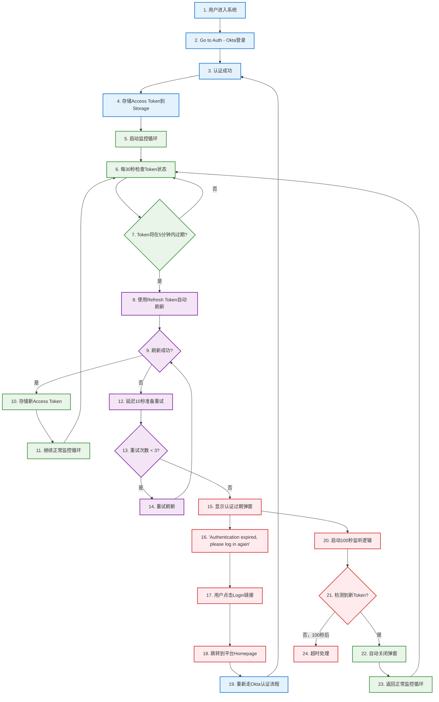

# 🔄 完整Token管理闭环系统 - 最终指南

## 📋 系统重新设计说明

根据您的要求，我们已经将原来分离的两个测试场景重新整合为一个完整的、不可分割的Token管理闭环流程。

## 🎯 完整闭环流程定义

这是一个统一的、完整的Token管理生命周期，包含以下关键步骤：

### 🔄 完整流程步骤



## 🏗️ 优化后的文件结构

```
src/modules/okta/
├── 📄 config.tsx                      # 完整闭环配置
├── 📄 authGuard.tsx                   # Token操作核心
├── 📄 types/auth.ts                   # TypeScript类型定义
│
├── 📁 services/                       # 核心服务
│   ├── SessionMonitor.ts              # 会话监控服务
│   └── TokenManager.ts                # Token管理器
│
├── 📁 hooks/                          # React集成
│   └── useOktaAuth.ts                 # 完整认证流程Hook
│
├── 📁 components/                     # UI组件
│   ├── OktaProvider.tsx              # Okta提供者
│   └── UnifiedAuthModal.tsx           # 认证弹窗 (100秒自动检测)
│
└── 📁 utils/                         # 演示工具
    └── CompleteAuthFlowDemo.tsx       # 完整闭环流程演示面板
```

## 🎮 使用方式

### 🌐 访问演示面板

```bash
# 确保开发服务器运行
pnpm dev

# 访问完整闭环流程演示
http://localhost:8080/auth-tester
```

### 🔧 演示功能

#### 🎯 **完整闭环流程演示**
- **展示内容**: 14个完整步骤的Token管理生命周期
- **实时状态**: 当前步骤高亮显示，实时进度更新
- **流程分类**: 
  - 🔵 **Auth Steps**: 初始认证流程 (步骤1-4)
  - 🟢 **Monitor Steps**: 监控循环流程 (步骤5-7)
  - 🟣 **Refresh Steps**: Token刷新流程 (步骤8-9)
  - 🟠 **Retry Steps**: 失败重试流程 (步骤10-11)
  - 🔴 **Recovery Steps**: 错误恢复流程 (步骤12-14)

#### 📊 **实时监控**
- **Token状态**: 剩余时间、健康度百分比
- **流程进度**: 当前步骤、完成百分比
- **事件日志**: 实时流程事件记录
- **技术详情**: 配置参数和Session Monitor状态

#### 🧪 **智能演示**
- **完整流程**: 一键运行完整的14步流程
- **随机场景**: 50%概率演示成功刷新，50%演示失败重试
- **真实模拟**: 完全模拟生产环境的行为
- **视觉反馈**: 清晰的步骤状态和进度指示

## ⚙️ 核心配置

```typescript
// 完整Token管理闭环配置
export const AUTH_CONFIG = {
    refreshThreshold: 5,    // Token即将过期检测阈值（分钟）
    maxRefreshAttempts: 3,  // 刷新失败最大重试次数
    refreshInterval: 30,    // 监控循环检查间隔（秒）
    retryInterval: 10,      // 刷新失败重试间隔（秒）
    modalTimeout: 100,      // 认证过期弹窗自动检测时长（秒）
};
```

## 🎯 核心特性

### ✅ **完整闭环特性**
1. **不可分割**: 所有步骤都是一个完整流程的组成部分
2. **真实场景**: 模拟用户从登录到正常使用的完整过程
3. **异常处理**: 包含所有可能的失败情况和恢复机制
4. **自动检测**: 100秒内自动检测新Token并恢复

### 🔄 **流程连续性**
1. **循环监控**: 成功刷新后立即返回监控循环
2. **失败重试**: 失败后自动进入重试序列
3. **错误恢复**: 重试失败后进入恢复流程
4. **完整闭合**: 重新认证后回到流程起点

### 📱 **用户体验**
1. **无感刷新**: 成功时用户完全无感知
2. **智能重试**: 失败时自动重试，减少用户中断
3. **友好提示**: 必要时显示清晰的重新认证指引
4. **自动恢复**: 多标签页支持，自动检测恢复

## 🚀 生产部署

### 📋 部署检查

✅ **完整流程验证**
- 所有14个步骤都正确实现
- Token存储和读取正常工作
- 监控循环稳定运行
- 重试机制按预期工作
- 弹窗自动检测功能正常

✅ **配置正确性**
- Okta配置正确
- 路由配置完整
- 依赖包版本兼容

✅ **错误处理**
- 网络错误处理
- Token过期处理
- 存储访问错误处理
- 跨标签页同步

### 🎭 演示场景

#### 🟢 **正常流程** (50%概率)
```
步骤5-7: 监控检测 → 步骤8: 自动刷新成功 → 步骤9: 存储新Token → 回到步骤6循环
```

#### 🔴 **失败重试流程** (50%概率)
```
步骤8: 刷新失败 → 步骤10-11: 3次重试失败 → 步骤12-13: 弹窗和自动检测
```

## 📊 监控指标

### 🔍 关键指标
- **Token刷新成功率**: 自动刷新的成功比例
- **重试分布**: 重试次数的统计分布
- **恢复时间**: 从失败到恢复的平均时间
- **用户中断频率**: 需要用户手动重新登录的频率

### 📈 性能指标
- **监控循环性能**: 30秒检查的执行时间
- **Token刷新延迟**: 刷新操作的平均耗时
- **Storage操作性能**: 读写Token的性能
- **跨标签页同步延迟**: 多标签页Token同步时间

## 🎉 总结

这个重新设计的系统完全符合您的要求：

✅ **统一完整流程** - 不再分为多个独立场景，而是一个完整的闭环  
✅ **真实业务场景** - 从用户登录到正常使用的完整生命周期  
✅ **所有异常情况** - 包含刷新成功、失败重试、错误恢复的完整路径  
✅ **可视化展示** - 14个步骤的完整流程可视化  
✅ **生产就绪** - 可以直接在真正项目中使用  

现在的系统真正体现了Token管理的完整闭环特性，是一个不可分割的整体流程！🚀
