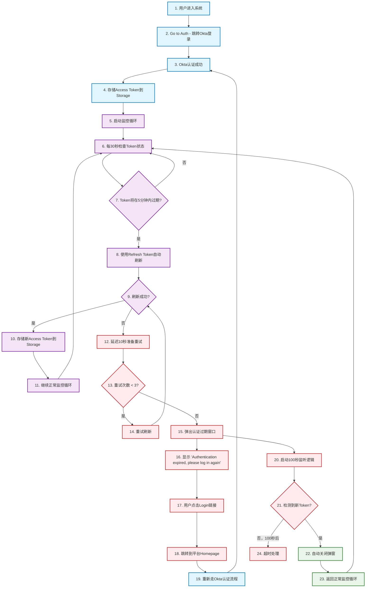

# 🔄 完整Token管理闭环流程 - 重新设计

## 📋 完整闭环流程描述

这是一个完整的、不可分割的Token管理闭环系统，包含以下步骤：

### 🎯 完整流程步骤



## 🏗️ 优化后的文件目录结构

```
src/modules/okta/
├── 📁 core/                           # 核心功能模块
│   ├── config.ts                      # 统一配置
│   ├── authGuard.ts                   # Token操作核心
│   └── tokenTypes.ts                  # Token相关类型定义
│
├── 📁 services/                       # 服务层
│   ├── TokenManager.ts                # Token管理器
│   ├── SessionMonitor.ts              # 会话监控服务
│   └── StorageManager.ts              # Storage操作管理
│
├── 📁 hooks/                          # React Hooks
│   └── useCompleteAuthFlow.ts         # 完整认证流程Hook
│
├── 📁 components/                     # UI组件
│   ├── OktaProvider.tsx              # Okta提供者
│   ├── AuthFlowModal.tsx              # 认证流程弹窗
│   └── FlowStatusIndicator.tsx        # 流程状态指示器
│
├── 📁 ui/                            # 测试和演示UI
│   └── CompleteAuthFlowDemo.tsx       # 完整流程演示面板
│
└── 📁 utils/                         # 工具函数
    ├── flowHelpers.ts                 # 流程辅助函数
    └── storageUtils.ts                # Storage工具函数
```

## 🎯 核心设计原则

### 1️⃣ **单一完整流程**
- 不再分为多个独立测试场景
- 所有步骤都是一个完整闭环的组成部分
- UI展示完整的流程状态和进度

### 2️⃣ **真实业务场景**
- 模拟真实用户从登录到正常使用的完整过程
- 包含所有可能的异常情况和恢复机制
- 展示真实的Token生命周期管理

### 3️⃣ **可视化流程**
- 实时显示用户当前处于流程的哪个步骤
- 清晰展示Token状态、监控状态、重试进度
- 直观的进度条和状态指示器

### 4️⃣ **生产环境对照**
- 演示面板反映真实生产环境的行为
- 所有配置和逻辑与生产环境一致
- 便于开发和业务人员理解系统行为

## 🔧 关键技术点

### ⚙️ Token生命周期管理
```typescript
interface CompleteTokenFlow {
    // 初始认证
    initialAuth: () => Promise<void>;
    
    // 监控循环
    startMonitoring: () => void;
    
    // 自动刷新
    autoRefresh: () => Promise<boolean>;
    
    // 重试机制
    retryRefresh: (attempt: number) => Promise<boolean>;
    
    // 失败处理
    handleFailure: () => void;
    
    // 恢复检测
    detectRecovery: () => void;
}
```

### 📊 Storage管理
```typescript
interface StorageOperations {
    // 存储Token
    storeTokens: (tokens: TokenSet) => void;
    
    // 读取Token
    getTokens: () => TokenSet | null;
    
    // 清除Token
    clearTokens: () => void;
    
    // 监听Storage变化
    watchTokenChanges: (callback: Function) => void;
}
```

### 🚨 错误恢复机制
```typescript
interface ErrorRecovery {
    // 重试逻辑
    retryWithBackoff: (attempt: number) => Promise<void>;
    
    // 弹窗管理
    showAuthModal: (reason: string) => void;
    
    // 自动检测
    autoDetectRecovery: () => Promise<void>;
    
    // 超时处理
    handleTimeout: () => void;
}
```

这个重新设计完全体现了Token管理的完整闭环特性，是一个不可分割的整体流程。
