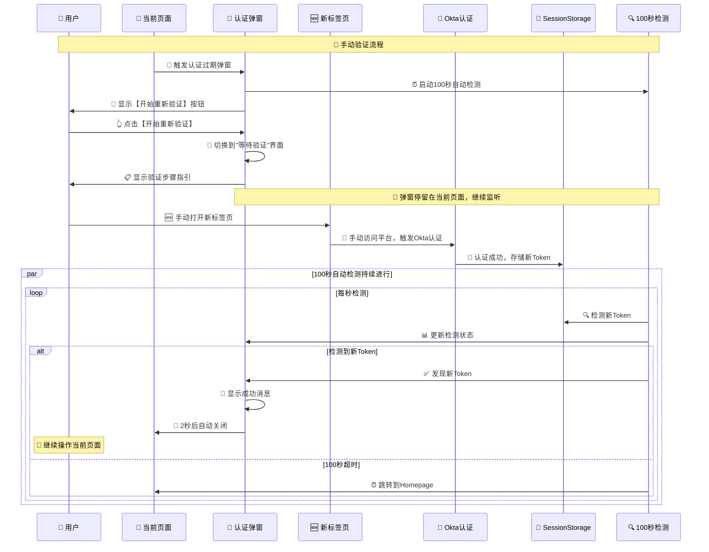

# 🔄 手动验证弹窗优化指南

## 🎯 优化需求理解

根据您的要求，我们已经优化了认证过期弹窗的逻辑：

- ✅ **用户点击【开始重新验证】后停留在当前页面**
- ✅ **不自动跳转，用户手动完成验证流程**  
- ✅ **弹窗继续100秒监听逻辑**
- ✅ **检测到新Token后自动关闭弹窗**

## 🔄 优化后的完整流程



## 🔧 核心优化点

### 1️⃣ **不自动跳转设计**

#### ✅ **优化前的问题**
```typescript
// 旧版本：自动跳转
const handleReauthorize = () => {
    oktaAuth.signInWithRedirect(); // ❌ 自动跳转离开当前页面
};
```

#### 🚀 **优化后的解决方案**
```typescript
// 新版本：手动验证
const handleReauthorize = () => {
    console.log('🔐 用户点击【重新验证】按钮 - 提示用户手动操作');
    setIsReauthorizing(true);
    addDetectionEvent('用户点击重新验证 - 请手动打开新标签页完成验证');
    
    // ✅ 不执行自动跳转，让用户手动完成验证
    // ✅ 弹窗继续监听100秒，等待用户在其他标签页完成验证
};
```

### 2️⃣ **三阶段UI状态**

#### 🚨 **阶段1: 初始状态**
- 显示认证过期信息
- 【开始重新验证】按钮
- 100秒自动检测倒计时

#### 🔄 **阶段2: 等待验证状态**
- 用户点击按钮后进入
- 显示详细的手动验证步骤指引
- 继续100秒自动检测
- 按钮变为"等待验证中..."

#### ✅ **阶段3: 检测成功状态**
- 检测到新Token时显示
- 成功消息确认
- 2秒后自动关闭弹窗

### 3️⃣ **详细的用户指引**

#### 📋 **手动验证步骤指引**
```jsx
<ol className="space-y-2 text-sm text-blue-700">
    <li>1. 在新标签页中打开平台网站</li>
    <li>2. 系统会自动跳转到Okta登录页面</li>  
    <li>3. 完成Okta身份验证</li>
    <li>✓ 验证成功后，此弹窗将自动关闭</li>
</ol>
```

#### 💡 **用户体验优化**
- 明确告诉用户需要做什么
- 说明弹窗会继续监听
- 提示验证成功后会自动关闭

### 4️⃣ **持续的100秒监听**

#### 🔍 **智能检测逻辑**
```typescript
// 检测逻辑在等待验证状态下继续运行
checkInterval = setInterval(async () => {
    const tokenInfo = await getTokenInfo();
    if (tokenInfo && !tokenInfo.isExpired) {
        console.log('✅ 检测到新Token - 自动关闭弹窗');
        addDetectionEvent('✅ 检测到新Token - 认证成功');
        setHasNewToken(true);
        
        // 显示成功消息2秒后自动关闭
        setTimeout(() => {
            onClose(); // 关闭弹窗，用户继续操作当前页面
        }, 2000);
    }
}, 1000);
```

#### 📊 **可视化监听状态**
- 实时倒计时显示
- 进度条可视化
- 检测状态实时更新
- 检测事件日志记录

## 🧪 测试步骤

### 🌐 **访问测试页面**
```bash
http://localhost:8080/auth-tester
```

### 🔧 **完整测试流程**

#### 1️⃣ **触发认证过期弹窗**
- 运行完整流程演示
- 等待失败重试阶段
- 观察认证过期弹窗显示

#### 2️⃣ **测试【开始重新验证】按钮**
- 点击【开始重新验证】按钮
- ✅ **确认页面未跳转**（重要！）
- 观察弹窗切换到等待验证界面
- 查看详细的验证步骤指引

#### 3️⃣ **测试手动验证流程**
- 按照指引在新标签页打开平台网站
- 完成Okta认证流程
- 返回原标签页观察弹窗状态

#### 4️⃣ **测试自动检测和关闭**
- 观察弹窗检测到新Token
- 确认显示成功消息
- 确认2秒后自动关闭
- ✅ **确认用户可以继续操作当前页面**

## 📋 优化对比

### ❌ **优化前的问题**
1. 点击按钮后自动跳转离开当前页面
2. 用户丢失当前操作上下文
3. 需要重新导航回到原页面
4. 用户体验不连贯

### ✅ **优化后的优势**
1. 用户停留在当前页面，保持操作上下文
2. 弹窗继续监听，提供实时反馈
3. 明确的操作指引，降低用户困惑
4. 自动检测和关闭，无缝的用户体验

## 🚀 生产环境注意事项

### 🔧 **配置确认**
```typescript
export const AUTH_CONFIG = {
    modalTimeout: 100,      // 100秒监听时间
    // 其他配置保持不变
};
```

### 📊 **监控指标**
- **用户完成率**: 用户成功完成手动验证的比例
- **检测成功率**: 100秒内成功检测到新Token的比例
- **用户停留率**: 用户选择停留在当前页面的比例
- **操作连续性**: 验证完成后用户继续操作的比例

## 🎉 总结

这次优化完美实现了您的要求：

✅ **用户点击后停留在当前页面** - 不自动跳转，保持操作上下文  
✅ **手动完成验证流程** - 用户按指引在新标签页完成验证  
✅ **弹窗继续100秒监听** - 实时检测新Token状态  
✅ **获取新Token后自动关闭** - 检测成功后无缝恢复用户操作  

现在的认证过期弹窗提供了更加用户友好的手动验证体验！🚀
