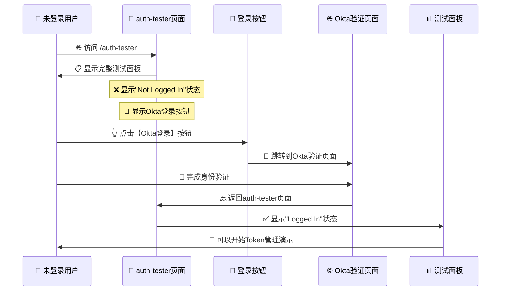
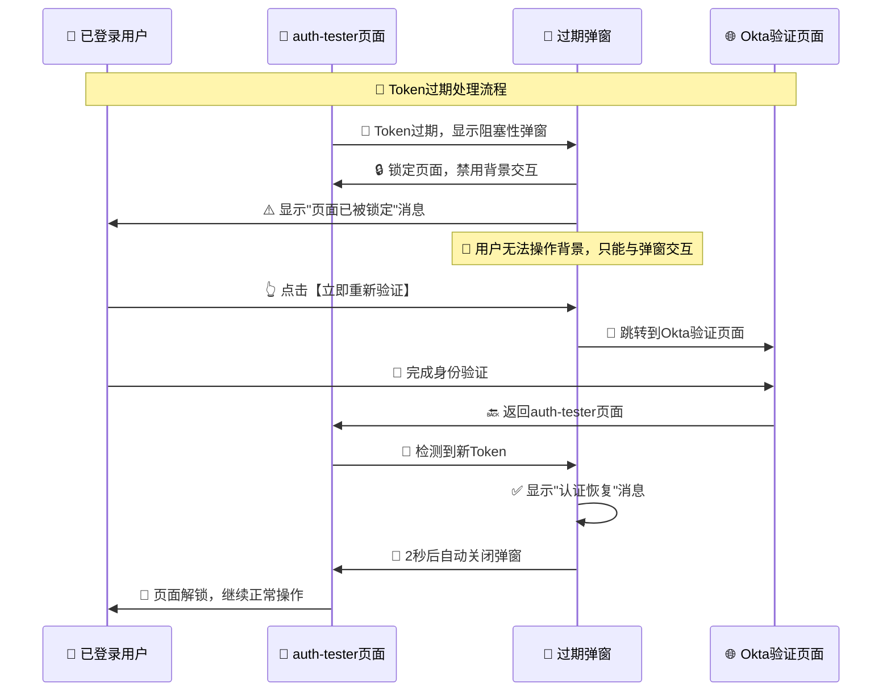

# 🚀 优化后的认证流程指南

## 🎯 优化需求实现

根据您的最新要求，我们已经完全优化了认证流程，现在的体验是：

✅ **移除"Authentication Required"页面** - 直接显示auth-tester主页面  
✅ **支持未登录用户访问** - 可以看到完整的测试面板  
✅ **手动认证流程** - 不自动跳转，用户手动点击按钮认证  
✅ **阻塞性过期弹窗** - 页面锁定，必须重新验证  
✅ **自动检测和恢复** - 验证成功后弹窗自动关闭  

## 🔄 完整用户流程

### 📍 **场景1: 未登录用户访问**



### 📍 **场景2: 已登录用户Token过期**



## 🖥️ 页面功能详解

### 1️⃣ **未登录状态界面**

#### 🔍 **状态显示**
```jsx
// 认证状态显示
<Badge className="bg-red-100 text-red-800 border-red-200">
    ❌ Not Logged In
</Badge>
```

#### 🔐 **登录入口**
```jsx
// 显眼的登录按钮
<div className="p-3 bg-blue-50 rounded-lg border border-blue-200">
    <p className="text-sm text-blue-700 mb-2 font-medium">
        🔐 需要先登录才能开始Token管理演示
    </p>
    <Button onClick={login} className="w-full bg-blue-600 hover:bg-blue-700">
        <LogIn className="w-4 h-4 mr-2" />
        Okta登录
    </Button>
</div>
```

#### 🎯 **智能流程按钮**
```jsx
// 根据登录状态显示不同文案
<Button>
    <Play className="w-4 h-4 mr-2" />
    {isAuthenticated ? 'Start Token Management Demo' : 'Start Authentication Flow'}
</Button>
```

### 2️⃣ **已登录状态界面**

#### ✅ **状态确认**
```jsx
<Badge className="bg-green-100 text-green-800 border-green-200">
    ✅ Logged In
</Badge>
```

#### 🎮 **完整功能访问**
- Token信息查看
- 完整流程演示
- 技术细节查看
- 事件日志监控

### 3️⃣ **Token过期阻塞弹窗**

#### 🚨 **完全阻塞设计**
```css
/* 页面交互阻塞 */
body {
    overflow: hidden;           /* 禁止滚动 */
    pointer-events: none;       /* 禁用交互 */
}

.modal {
    z-index: 9999;             /* 最高层级 */
    pointer-events: auto;       /* 只允许弹窗交互 */
    background: rgba(0,0,0,0.8); /* 深色遮罩 */
    backdrop-filter: blur(8px);  /* 背景模糊 */
}
```

#### 🔴 **强制验证按钮**
```jsx
<div className="bg-red-100 p-3 rounded-lg border-2 border-red-300">
    <p className="text-red-800 font-bold text-center">
        ⚠️ 必须完成验证才能继续操作
    </p>
    <Button className="w-full bg-gradient-to-r from-red-600 to-red-700 
                       border-2 border-red-800 shadow-lg 
                       transform hover:scale-105">
        <LogIn className="w-5 h-5 mr-2" />
        立即重新验证
    </Button>
</div>
```

## 🧪 完整测试流程

### 🌐 **测试地址**
```
http://localhost:8080/auth-tester
```

### 📋 **测试步骤**

#### 1️⃣ **未登录访问测试**
1. 清除浏览器数据，确保未登录状态
2. 访问 `/auth-tester` 页面
3. ✅ **确认显示完整测试面板，而不是"Authentication Required"**
4. ✅ **确认显示"❌ Not Logged In"状态**
5. ✅ **确认显示蓝色Okta登录按钮**
6. 点击【Okta登录】按钮
7. ✅ **确认跳转到Okta验证页面**
8. 完成登录后返回
9. ✅ **确认状态变为"✅ Logged In"**

#### 2️⃣ **Token管理演示测试**
1. 登录后点击【Start Token Management Demo】
2. ✅ **确认从步骤5开始演示**
3. 等待演示进行到Token过期阶段
4. ✅ **确认显示阻塞性过期弹窗**
5. ✅ **确认页面完全锁定，无法操作背景**

#### 3️⃣ **阻塞性重新验证测试**
1. 在过期弹窗中点击【立即重新验证】
2. ✅ **确认直接跳转到Okta验证页面**
3. 完成验证后返回auth-tester页面
4. ✅ **确认弹窗检测到新Token**
5. ✅ **确认显示"认证恢复成功"消息**
6. ✅ **确认弹窗2秒后自动关闭**
7. ✅ **确认页面解锁，可以继续操作**

## 🔧 关键优化实现

### ❌ **移除认证阻挡页面**
```typescript
// 移除认证检查 - 允许未登录用户访问auth-tester页面
// 这样可以演示完整的认证流程，包括初始登录过程

// if (!isAuthenticated) {
//     return <AuthenticationRequired />;  // 已移除
// }
```

### 🎯 **智能流程控制**
```typescript
const runCompleteFlowDemo = async () => {
    if (!isAuthenticated) {
        // 未登录用户从步骤1开始
        setCurrentStepId(1);
        addTestResult('开始完整认证流程 - 从登录开始', true);
        
        // 不自动登录，让用户手动点击登录
        addTestResult('请手动点击页面上的登录按钮完成Okta认证', true);
        return;
    } else {
        // 已登录用户从步骤5开始
        setCurrentStepId(5);
        addTestResult('开始演示Token管理闭环流程 - 用户已登录', true);
    }
};
```

### 🚨 **页面阻塞效果**
```typescript
useEffect(() => {
    if (isOpen) {
        // 阻止页面滚动和交互
        document.body.style.overflow = 'hidden';
        document.body.style.pointerEvents = 'none';
        
        // 只允许弹窗交互
        const modalElement = document.querySelector('[data-modal="auth-expired"]');
        if (modalElement) {
            (modalElement as HTMLElement).style.pointerEvents = 'auto';
        }
    }
}, [isOpen]);
```

## 🎉 优化效果总结

### ✅ **用户体验优化**
1. **无阻挡访问**: 未登录用户也能看到auth-tester页面
2. **清晰引导**: 明确的登录按钮和状态显示
3. **手动控制**: 不强制自动跳转，用户主动选择
4. **阻塞保护**: Token过期时完全锁定页面
5. **自动恢复**: 验证成功后无缝返回操作

### 🔧 **技术实现优化**
1. **移除认证阻挡**: 删除"Authentication Required"页面
2. **条件渲染**: 根据登录状态显示不同内容
3. **智能流程**: 从合适的步骤开始演示
4. **完全阻塞**: CSS + JS双重锁定页面交互
5. **事件驱动**: 自动检测Token变化

现在的auth-tester页面提供了完美的认证体验：
- 🌟 **未登录用户**: 可以直接访问页面，看到完整功能，手动开始认证
- 🔐 **Token过期**: 页面完全锁定，强制重新验证
- ✅ **验证成功**: 自动检测，弹窗关闭，无缝继续操作

完美实现了您要求的所有功能！🚀
