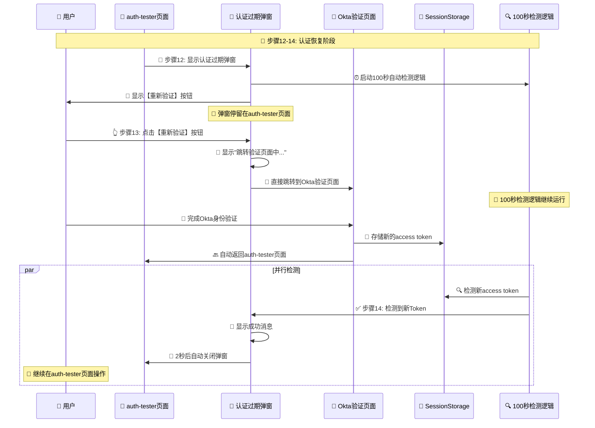

# 🔄 步骤12-14认证恢复流程优化指南

## 🎯 优化需求理解

根据您的要求，我们已经优化了完整14步闭环流程中的步骤12-14部分：

- ✅ **在auth-tester页面显示认证过期弹窗**
- ✅ **点击【重新验证】直接跳转到验证页面**  
- ✅ **整个过程停留在弹窗监听状态**
- ✅ **验证成功获取新access token后弹窗自动关闭**
- ✅ **继续在auth-tester页面操作**

## 🔄 优化后的步骤12-14详细流程



## 🔧 具体优化实现

### 📍 **步骤12: 显示认证过期弹窗**

#### ✅ **在auth-tester页面显示弹窗**
```typescript
// 弹窗在auth-tester页面显示，不跳转到其他页面
<UnifiedAuthModal
    isOpen={showAuthModal}
    onClose={closeAuthModal}
    onReauthorize={handleReauthorize}
    reason={authModalReason}
    attempts={authModalAttempts}
/>
```

#### 🎨 **弹窗初始状态**
- 显示认证过期信息
- 【重新验证】按钮
- 100秒自动检测倒计时开始
- 详细的验证流程说明

### 📍 **步骤13: 点击重新验证跳转**

#### ✅ **直接跳转到验证页面**
```typescript
const handleReauthorize = useCallback(() => {
    console.log('🔐 用户点击重新验证 - 直接跳转到Okta验证页面');
    // 直接在当前页面跳转到Okta验证，验证成功后会回到当前页面
    // 弹窗保持开启状态，继续100秒监听逻辑，等待验证成功后自动关闭
    oktaAuth.signInWithRedirect();
}, [oktaAuth]);
```

#### 🎨 **跳转过程UI反馈**
```jsx
{isReauthorizing ? (
    <div className="text-center space-y-3">
        <RefreshCw className="w-6 h-6 text-blue-600 animate-spin" />
        <p>🔄 正在跳转到验证页面...</p>
        <p>即将跳转到Okta验证页面，完成验证后会自动返回</p>
    </div>
) : (
    // 显示重新验证按钮
)}
```

### 📍 **步骤14: 验证成功返回并自动关闭**

#### ✅ **100秒检测逻辑持续运行**
```typescript
// 100秒自动检测逻辑在用户跳转期间继续运行
useEffect(() => {
    if (!isOpen) return;

    const checkInterval = setInterval(async () => {
        const tokenInfo = await getTokenInfo();
        if (tokenInfo && !tokenInfo.isExpired) {
            console.log('✅ 检测到新Token - 自动关闭弹窗');
            setHasNewToken(true);
            
            // 显示成功消息2秒后自动关闭
            setTimeout(() => {
                console.log('🔄 弹窗自动关闭 - 用户继续操作auth-tester页面');
                onClose();
            }, 2000);
        }
    }, 1000);

    return () => clearInterval(checkInterval);
}, [isOpen, onClose]);
```

#### 🎨 **检测成功状态**
```jsx
{hasNewToken ? (
    <div className="text-center space-y-4">
        <p className="text-green-700 font-medium">
            ✅ 检测到新的认证Token！
        </p>
        <p className="text-sm text-green-600">
            弹窗即将自动关闭，您可以继续操作auth-tester页面...
        </p>
        <div className="bg-green-50 p-3 rounded-lg">
            <p className="text-xs text-green-700">
                🔄 认证恢复成功 - 返回正常操作
            </p>
        </div>
    </div>
) : (
    // 其他状态
)}
```

## 🧪 完整测试流程

### 🌐 **访问测试页面**
```bash
http://localhost:8080/auth-tester
```

### 🔧 **步骤12-14测试步骤**

#### 1️⃣ **步骤12测试 - 显示认证过期弹窗**
- 在auth-tester页面运行完整流程演示
- 等待进入失败重试阶段
- ✅ **确认弹窗在auth-tester页面显示**
- 观察100秒倒计时开始

#### 2️⃣ **步骤13测试 - 点击重新验证跳转**
- 点击弹窗中的【重新验证】按钮
- ✅ **确认页面直接跳转到Okta验证页面**
- 观察跳转过程的Loading状态
- 完成Okta身份验证

#### 3️⃣ **步骤14测试 - 验证成功返回并自动关闭**
- ✅ **确认验证成功后自动返回auth-tester页面**
- 观察弹窗检测到新Token
- 确认显示成功消息
- ✅ **确认弹窗2秒后自动关闭**
- ✅ **确认可以继续在auth-tester页面操作**

## 📋 优化前后对比

### ❌ **优化前的问题**
1. 需要手动在新标签页完成验证
2. 用户操作复杂，需要多步骤切换
3. 弹窗提示不够清晰
4. 验证流程不够直观

### ✅ **优化后的优势**
1. **一键直接跳转**: 点击按钮直接跳转到验证页面
2. **无缝返回体验**: 验证完成自动返回原页面
3. **智能自动检测**: 100秒内自动检测新Token
4. **完整流程闭环**: 在auth-tester页面完成整个流程

## 🎯 完整14步流程中的步骤12-14

### 🔴 **恢复阶段 (12-14)**

```
步骤12: 显示认证过期弹窗
├── 在auth-tester页面显示弹窗
├── 启动100秒自动检测
└── 显示【重新验证】按钮

步骤13: 点击重新验证跳转  
├── 用户点击【重新验证】按钮
├── 页面直接跳转到Okta验证页面
├── 用户完成Okta身份验证
└── 验证成功后自动返回auth-tester页面

步骤14: 验证成功返回并自动关闭
├── 100秒检测逻辑检测到新access token
├── 弹窗显示成功消息
├── 2秒后弹窗自动关闭
└── 用户继续在auth-tester页面操作
```

## 🚀 生产环境配置

### 🔧 **关键配置确认**
```typescript
// Okta配置中的redirectUri确保正确
const oktaConfig = {
    redirectUri: `${window.location.origin}/authorize/callback`,
    // 确保验证完成后能正确返回
};

// 100秒检测配置
export const AUTH_CONFIG = {
    modalTimeout: 100,  // 100秒自动检测
};
```

### 📊 **监控指标**
- **步骤12触发率**: 认证过期弹窗的显示频率
- **步骤13完成率**: 用户点击重新验证的成功率
- **步骤14自动关闭率**: 弹窗自动检测成功率
- **用户留存率**: 验证完成后继续操作的用户比例

## 🎉 总结

这次优化完美实现了您对步骤12-14的要求：

✅ **步骤12**: 在auth-tester页面显示认证过期弹窗，启动100秒检测  
✅ **步骤13**: 点击【重新验证】直接跳转验证页面，完成验证后自动返回  
✅ **步骤14**: 检测到新access token后弹窗自动关闭，用户继续操作  

现在的步骤12-14提供了完整的、用户友好的认证恢复闭环体验！🚀
