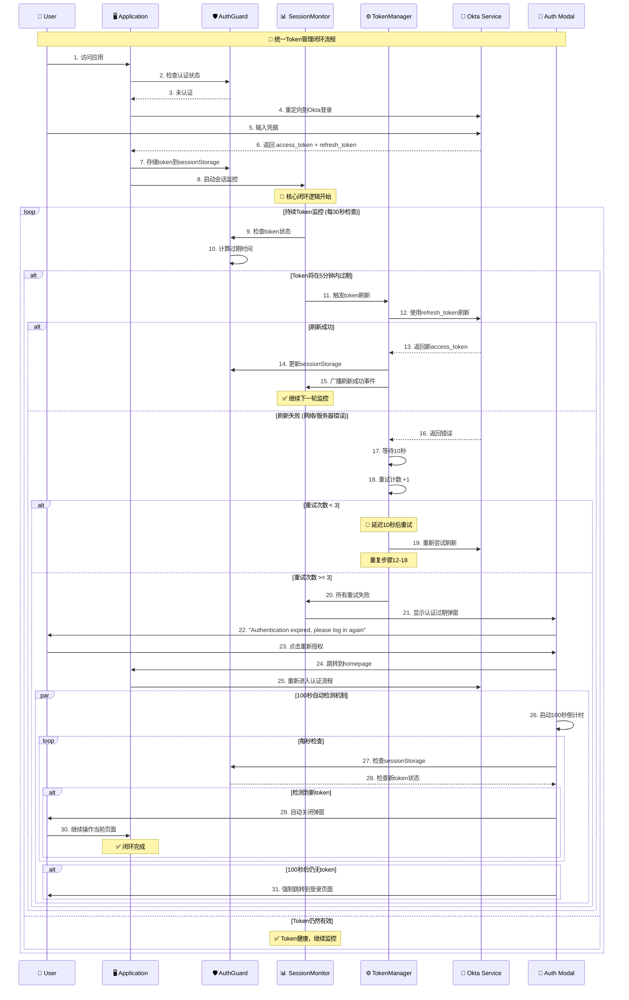

# 🔄 统一Token管理闭环流程图

## 📊 完整的Token管理时序图



## 🔀 简化流程图 - 核心闭环逻辑

```mermaid
flowchart TD
    A[👤 用户登录成功] --> B[🛡️ Token存储到sessionStorage]
    B --> C[📊 启动Session监控]
    C --> D{⏰ Token将在5分钟内过期?}
    
    D -->|是| E[⚙️ 尝试刷新Token]
    D -->|否| F[✅ 继续监控]
    F --> D
    
    E --> G{🔄 刷新成功?}
    G -->|是| H[✅ 更新Token]
    H --> I[📡 广播成功事件]
    I --> D
    
    G -->|否| J[⏱️ 等待10秒]
    J --> K{🔢 重试次数 < 3?}
    K -->|是| L[🔄 重试刷新]
    L --> G
    
    K -->|否| M[🚨 显示认证过期弹窗]
    M --> N[👤 用户点击重新授权]
    N --> O[🏠 跳转到Homepage]
    O --> P[🔐 重新进入Okta认证]
    
    M --> Q[⏳ 启动100秒自动检测]
    Q --> R{📱 检测到新Token?}
    R -->|是| S[✅ 自动关闭弹窗]
    S --> T[🔄 用户继续当前页面操作]
    T --> D
    
    R -->|否，100秒后| U[🚫 强制跳转登录页]
    
    P --> A

    %% 样式定义
    classDef successNode fill:#d4edda,stroke:#28a745,stroke-width:2px,color:#155724
    classDef warningNode fill:#fff3cd,stroke:#ffc107,stroke-width:2px,color:#856404
    classDef errorNode fill:#f8d7da,stroke:#dc3545,stroke-width:2px,color:#721c24
    classDef processNode fill:#cce5ff,stroke:#007bff,stroke-width:2px,color:#004085
    
    class A,H,I,S,T successNode
    class D,G,K,R warningNode  
    class M,U errorNode
    class B,C,E,J,L,N,O,P,Q processNode
```

## 🎯 核心特点

### ✅ 统一的闭环逻辑
1. **无场景区分**: 不再区分场景1、场景2，统一为一个完整的Token管理闭环
2. **5分钟提前刷新**: Token即将过期前5分钟自动触发刷新
3. **智能重试机制**: 失败后10秒间隔重试，最多3次
4. **无感用户体验**: 成功刷新时用户完全无感知
5. **友好失败处理**: 重试失败后显示清晰的重新认证提示

### 🔄 闭环关键节点
1. **监控启动** → Token存储后立即开始30秒间隔检查
2. **提前刷新** → 5分钟到期前主动刷新，避免用户操作中断
3. **重试机制** → 网络问题时10秒间隔重试3次
4. **用户提示** → 失败后清晰提示"Authentication expired, please log in again"
5. **自动检测** → 100秒内检测新token，支持多标签页操作
6. **闭环完成** → 重新认证后继续原有操作流程

### 🎛️ 技术实现要点
- **SessionMonitor**: 统一管理所有token检查和刷新逻辑
- **TokenManager**: 处理重试计数和并发控制
- **Cross-tab Communication**: 支持多标签页token同步
- **Storage Monitoring**: 实时监控sessionStorage变化
- **Event Broadcasting**: 统一的事件通知机制

这个设计完全符合Tech Lead要求的"闭环逻辑"，没有复杂的场景区分，只有一个完整的Token生命周期管理流程。
