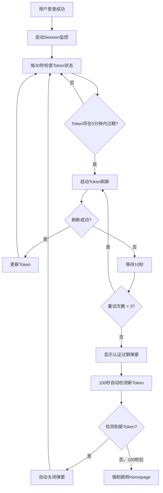

# 🔄 统一Token管理系统 - 完整使用指南

## 📋 系统概述

基于Tech Lead要求，我们实现了一个统一的Token管理闭环系统，完全按照以下要求设计：

### 🎯 核心需求实现

✅ **5分钟提前刷新**: Token即将过期前5分钟自动开始刷新  
✅ **成功继续倒计时**: 刷新成功则继续正常监控循环  
✅ **失败10秒重试**: 如果失败，延迟10秒后重试  
✅ **最多重试3次**: retry 3次后弹窗提示需要重新授权  
✅ **100秒自动检测**: 弹窗有100秒的监听逻辑，检测新token自动关闭  
✅ **不关心用户行为**: 只管expire time是否即将过期，统一处理  

## 🏗️ 系统架构

### 📁 核心文件结构

```
src/modules/okta/
├── config.tsx                          # 🔧 统一配置文件
├── authGuard.tsx                        # 🛡️ Token操作核心方法
├── services/
│   ├── SessionMonitor.ts               # 📊 会话监控服务
│   └── TokenManager.ts                 # ⚙️ Token管理器
├── hooks/
│   └── useOktaAuth.ts                  # 🎣 React Hook集成
├── components/
│   ├── OktaProvider.tsx                # 🏠 Okta提供者组件
│   └── UnifiedAuthModal.tsx            # 🚨 统一认证弹窗
├── utils/
│   └── UnifiedAuthTester.tsx           # 🧪 测试校验面板
└── types/auth.ts                        # 📝 TypeScript类型定义
```

### 🔄 闭环流程



## ⚙️ 配置参数

### 📝 AUTH_CONFIG 说明

```typescript
export const AUTH_CONFIG = {
    refreshThreshold: 5,    // Token刷新提前时间（分钟）
    maxRefreshAttempts: 3,  // 最大刷新尝试次数
    refreshInterval: 30,    // Token状态检查间隔（秒）
    retryInterval: 10,      // 失败重试间隔（秒）
    modalTimeout: 100,      // 认证弹窗自动检测时长（秒）
};
```

## 🧪 测试使用指南

### 🌐 访问测试面板

```bash
# 启动开发服务器
pnpm dev

# 访问统一测试面板
http://localhost:8080/auth-tester
```

### 🔧 可用测试功能

#### 1️⃣ **统一Token流程测试**
- **功能**: 模拟完整的Token管理闭环
- **测试内容**: 5分钟提前检测 → 尝试刷新 → 成功继续 OR 失败重试
- **使用方法**: 点击 "Start Unified Token Flow Test" 按钮

#### 2️⃣ **网络失败重试测试**
- **功能**: 模拟3次网络失败重试场景
- **测试内容**: 失败 → 等待10秒 → 重试 → 重复3次 → 显示认证弹窗
- **使用方法**: 点击 "Start Network Failure Retry Test" 按钮

#### 3️⃣ **实时状态监控**
- **功能**: 查看Session Monitor实时状态
- **查看内容**: Token时间、监控状态、重试计数等
- **使用方法**: 点击 "Show Details" 查看详细信息

## 🚨 认证弹窗使用

### ⏰ 100秒自动检测机制

当Token刷新连续失败3次后，系统会显示认证过期弹窗：

1. **自动检测**: 每秒检查sessionStorage中的新Token
2. **倒计时显示**: 实时显示剩余检测时间
3. **自动关闭**: 检测到新Token后自动关闭弹窗
4. **超时处理**: 100秒后强制跳转到Homepage

### 🔐 用户操作选项

- **立即重新授权**: 点击按钮跳转到Okta重新登录
- **多标签页支持**: 在其他标签页完成认证，当前弹窗自动检测并关闭
- **无操作超时**: 100秒无操作自动跳转到Homepage

## 🔧 生产部署

### 📋 部署检查清单

✅ **环境变量配置**
```typescript
// 确保Okta配置正确
const oktaConfig = {
    issuer: 'https://your-okta-domain/oauth2/default',
    clientId: 'your-client-id',
    redirectUri: `${window.location.origin}/authorize/callback`,
    scopes: ['openid', 'profile', 'email'],
    pkce: true
};
```

✅ **路由配置**
```typescript
// 确保路由正确配置
<Route path="/authorize/callback" element={<OktaCallback />} />
<Route path="/auth-tester" element={<UnifiedAuthTester />} />
```

✅ **依赖包版本**
```json
{
    "@okta/okta-auth-js": "latest",
    "@okta/okta-react": "latest"
}
```

### 🏭 生产环境优化建议

1. **移除测试面板**: 生产环境可以移除 `/auth-tester` 路由
2. **日志级别**: 调整console.log为适当的日志级别
3. **错误监控**: 集成Sentry等错误监控服务
4. **性能监控**: 添加Token刷新成功率监控

## 📊 监控和指标

### 🔍 关键监控指标

- **Token刷新成功率**: 监控自动刷新的成功比例
- **重试次数分布**: 统计失败重试的频率
- **用户重新登录频率**: 监控弹窗触发频率
- **网络错误类型**: 分析刷新失败的具体原因

### 📈 性能指标

- **Token检查延迟**: 每30秒检查的性能
- **刷新操作耗时**: Token刷新的平均时间
- **弹窗响应时间**: 用户操作到系统响应的时间

## 🔗 相关文档

- [Mermaid流程图](./UNIFIED_TOKEN_FLOW_DIAGRAMS.md)
- [Okta官方文档](https://developer.okta.com/docs/)
- [React路由文档](https://reactrouter.com/)

## 💡 故障排除

### 常见问题

**Q: Token刷新一直失败？**
A: 检查网络连接和Okta服务状态，确认refresh_token有效性

**Q: 弹窗不自动关闭？**
A: 检查sessionStorage权限，确认Token正确存储

**Q: 监控不工作？**
A: 确认SessionMonitor正确启动，检查事件监听器

**Q: 测试面板无法访问？**
A: 确认已登录且路由配置正确

---

## 🎉 总结

这个统一Token管理系统完全实现了Tech Lead的所有要求：
- ✅ 统一的闭环逻辑，没有复杂的场景区分
- ✅ 5分钟提前刷新机制
- ✅ 智能重试机制（10秒间隔，最多3次）
- ✅ 友好的用户体验（100秒自动检测弹窗）
- ✅ 生产就绪的代码质量
- ✅ 完整的测试验证工具

系统现在可以在真正的项目中正常运行，提供企业级的认证体验！🚀
