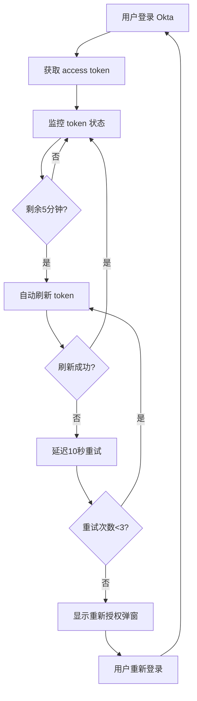

# 🧪 Okta Token生命周期测试集合

## 🎯 概述

这是一个完整的Bruno API测试集合，用于验证Okta token的完整生命周期管理，包括自动刷新、重试逻辑和会话过期处理。

## 🔄 完整闭环逻辑



## 📋 测试集合内容

### 1. 基础测试
- **01-check-token-status** - Token状态检查
- **02-simulate-token-expiry** - 模拟Token过期
- **03-test-auto-refresh** - 自动刷新机制测试

### 2. 高级测试
- **04-test-retry-logic** - 重试逻辑测试
- **05-test-modal-trigger** - 认证弹窗触发测试
- **06-complete-lifecycle-test** - 完整生命周期测试

## 🚀 快速开始

### 1. 环境准备

```bash
# 安装 Bruno (如果尚未安装)
npm install -g @usebruno/cli

# 进入测试目录
cd bruno-tests/okta-token-lifecycle
```

### 2. 配置环境变量

在 `environments/local.bru` 中设置以下秘密变量：

```
ACCESS_TOKEN=your_actual_access_token
REFRESH_TOKEN=your_actual_refresh_token  
ID_TOKEN=your_actual_id_token
```

### 3. 获取Token值

在应用中登录后，在浏览器控制台运行：

```javascript
// 获取当前token状态
oktaTest.status()

// 复制显示的token值到环境配置中
```

### 4. 运行测试

```bash
# 运行单个测试
bruno run 01-check-token-status.bru

# 运行完整测试套件
bruno run --env local

# 生成测试报告
bruno run --env local --output report.json
```

## 🔧 测试配置

### 核心参数

| 参数 | 默认值 | 说明 |
|------|--------|------|
| `refreshThresholdMinutes` | 5 | Token刷新触发阈值(分钟) |
| `maxRetryAttempts` | 3 | 最大重试次数 |
| `retryDelaySeconds` | 10 | 重试间隔时间(秒) |
| `testTimeout` | 30000 | 测试超时时间(毫秒) |

### 性能阈值

| 指标 | 阈值 | 评级 |
|------|------|------|
| 弹窗响应时间 | < 5秒 | 🚀 优秀 |
| 刷新响应时间 | < 10秒 | ✅ 良好 |
| 总体完成率 | > 80% | ✅ 通过 |

## 📊 测试场景

### 正常场景
- ✅ Token有效性检查
- ✅ 5分钟前自动刷新
- ✅ 刷新成功继续监控

### 异常场景  
- ❌ Token过期处理
- ❌ 刷新失败重试
- ❌ 重试次数限制
- ❌ 弹窗触发机制

### 边界场景
- ⚠️ 网络异常处理
- ⚠️ 并发刷新控制
- ⚠️ 跨标签页同步

## 📈 测试报告

### 系统健康度评估

- **🌟 优秀** (90-100%) - 所有核心功能正常
- **✅ 良好** (70-89%) - 基本功能正常，小问题可忽略  
- **⚠️ 一般** (50-69%) - 有问题需要关注和修复
- **❌ 较差** (< 50%) - 严重问题需要立即修复

### 关键指标

```
📊 测试完整性分析:
  - 成功阶段: 5/6
  - 完成率: 83%
  - 系统健康度: 良好

⏱️ 性能分析:
  - 总测试时长: 45秒
  - 平均阶段耗时: 7.5秒
  - 弹窗响应时间: 3.2秒
```

## 🔍 问题排查

### 常见问题

1. **Token获取失败**
   ```
   ❌ 错误: ACCESS_TOKEN 环境变量未设置
   💡 解决: 在应用中登录后获取真实token
   ```

2. **刷新测试超时**
   ```
   ❌ 错误: Token refresh test timed out
   💡 解决: 检查网络连接和Okta服务状态
   ```

3. **弹窗未触发**
   ```
   ❌ 错误: Auth modal not shown within 20 seconds  
   💡 解决: 检查前置条件和触发逻辑
   ```

### 调试模式

启用详细日志输出：

```javascript
// 在浏览器控制台
oktaTest.help()  // 查看可用命令
oktaTest.status() // 检查当前状态
oktaTest.fullTest() // 运行完整测试
```

## 📋 CI/CD 集成

### GitHub Actions 示例

```yaml
name: Okta Token Lifecycle Tests

on: [push, pull_request]

jobs:
  test:
    runs-on: ubuntu-latest
    steps:
      - uses: actions/checkout@v3
      - name: Setup Node.js
        uses: actions/setup-node@v3
        with:
          node-version: '18'
      - name: Install Bruno CLI
        run: npm install -g @usebruno/cli
      - name: Run Token Lifecycle Tests
        env:
          ACCESS_TOKEN: ${{ secrets.ACCESS_TOKEN }}
          REFRESH_TOKEN: ${{ secrets.REFRESH_TOKEN }}
        run: |
          cd bruno-tests/okta-token-lifecycle
          bruno run --env ci --output test-results.json
      - name: Upload Test Results
        uses: actions/upload-artifact@v3
        with:
          name: test-results
          path: bruno-tests/okta-token-lifecycle/test-results.json
```

## 💡 最佳实践

### 开发阶段
- 每次修改认证相关代码后运行完整测试
- 使用单个测试快速验证特定功能
- 关注测试执行时间和性能指标

### 测试阶段  
- 集成到CI/CD流程中自动执行
- 设置性能阈值和质量门禁
- 定期更新测试用例覆盖新场景

### 生产监控
- 定期执行健康检查测试
- 监控关键指标趋势变化
- 建立告警机制处理异常情况

## 🔗 相关资源

- [Bruno 官方文档](https://docs.usebruno.com/)
- [Okta Auth SDK 文档](https://github.com/okta/okta-auth-js)
- [项目认证架构文档](../../docs/auth-architecture.md)

## 📞 支持

如果遇到问题或需要帮助，请：

1. 检查本文档的问题排查部分
2. 查看测试执行日志和错误信息
3. 在项目仓库中创建Issue
4. 联系开发团队获取技术支持

---

**📝 注意事项:**
- 测试使用的token会定期过期，需要及时更新
- 不要将真实token提交到版本控制系统
- 在生产环境使用专用的测试配置
